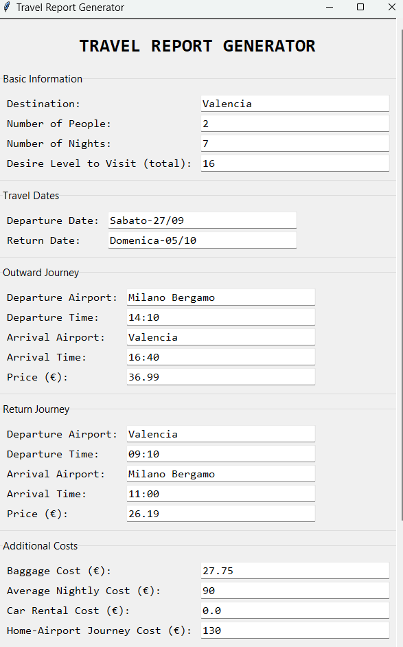
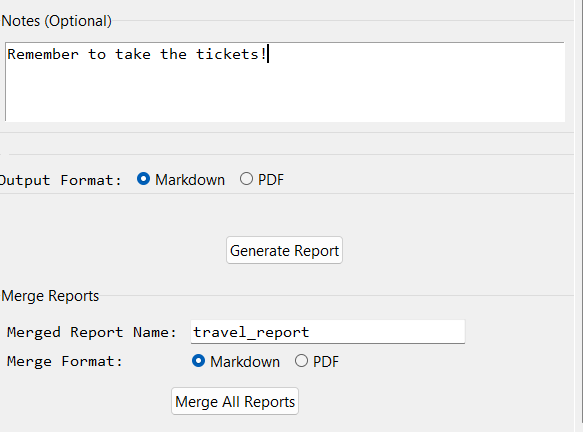
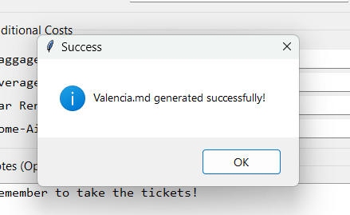
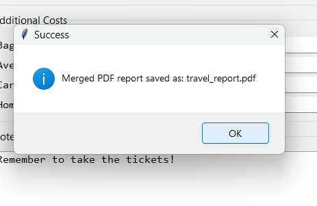

# What's that:
It takes info about your next travel and generate a small report, so you can think about different destinations with some comparison.  

Then you can merge the single reports into a big one.  

---

## How to run it:
1. Install python3 on your machine if is not already installed.  
2. Install `pandoc` on your system : [HERE](https://pandoc.org/installing.html)  
2. Run this command in the root folder:
    - `python -m travel_report_gui`  

---

## How to use it:
Just fill the fields, select the output format and press `Generate Report`.  
  

  
  
> This will generate a file called `Valencia.md` in the `/reports` folder. Like this:  
  

___

# Valencia

*Voglia di andarci*: _8.0/10_  
*Numero Notti*: _7_  

### Andata: **Sabato-27/09** - _36.99€_  
>**Partenza**: Milano Bergamo **14:40**  
>**Arrivo**: Valencia **16:40**  

### Ritorno: **Domenica-05/10** - _26.19€_  
>**Partenza**: Valencia **09:10**  
>**Arrivo**: Milano Bergamo **11:00**  

__Bagaglio__  
>10kg: 27.75€  

__Costo Medio a notte__  
>90.0€ per 2 persone.  

__Costo Noleggio Veicolo__  
>0.0€ per 6 giorni.  

__Costo Tragitto Casa Aeroporto__  
>130.0€ treno o auto + casello + taxi o bus o navette varie.  

__COSTI per 7 notti__  
>Totale: 823.18€  
>Tot a persona: 411.59€  
>Tot a notte per persona : 59€  

__Notes__: 
>Ricorda di controllare il gli scioperi dei voli

___  
  
## How to Merge your report  
  
Simply choose the output format and press `Merge All Reports`
  
You will find a merged file into the `/merged` directory.  
  
